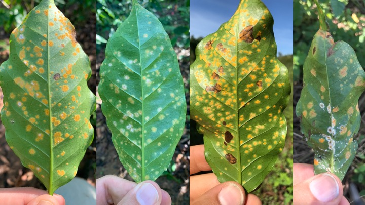

## Research interests
My interests are in doing things that are fun

## The community ecology of the coffee leaf rust 
   

## Spatial dyanmics of ecological interactions
   

**Competitive communities**

**Consumer resrouce communities**

### Other projects
I like other things

   

   

   
